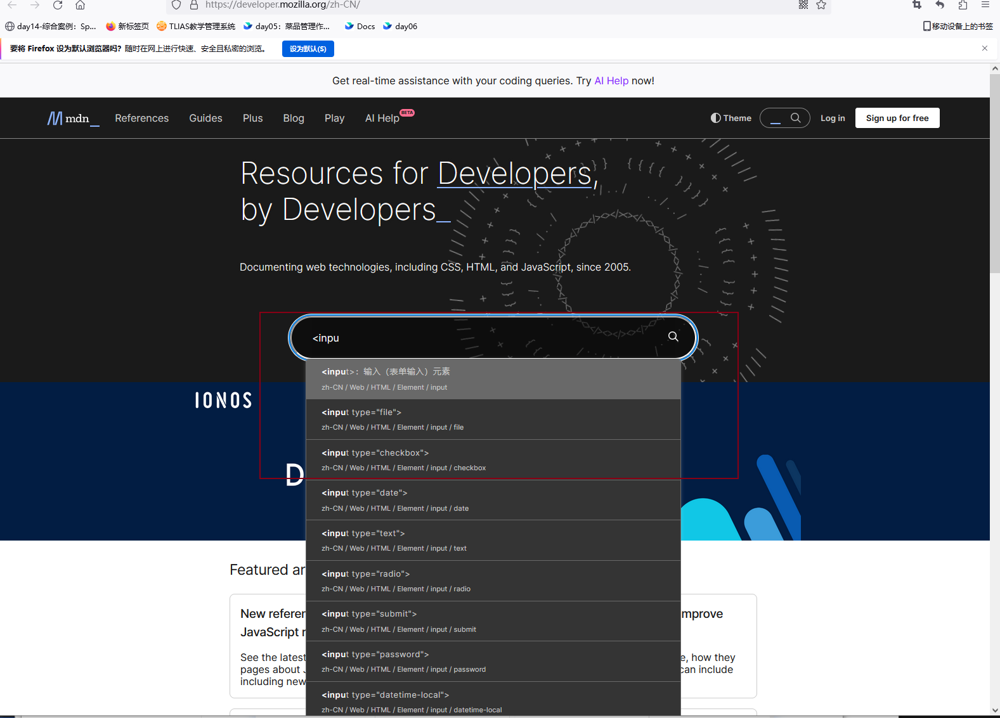
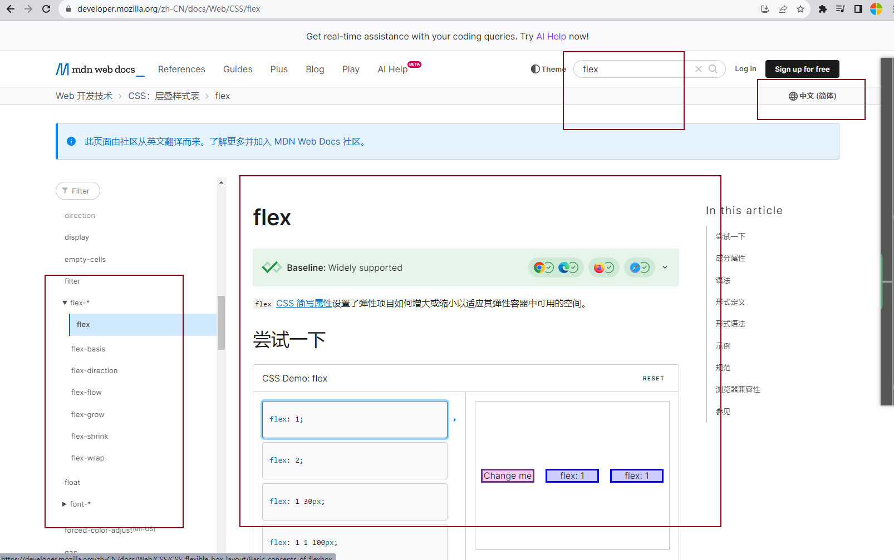
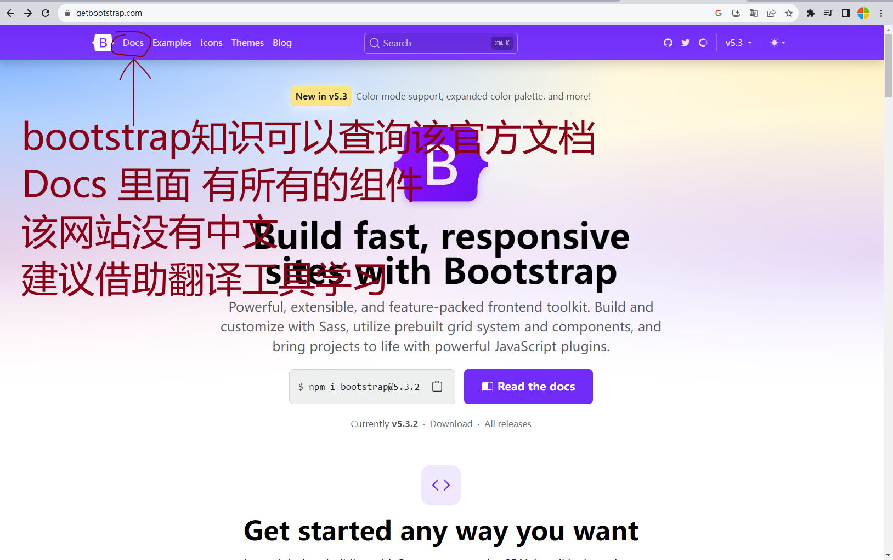

软件准备 vscodo编辑器（可以安装各种插件） chrome浏览器

总体学习资料：https://yun.itheima.com/subject/webmap/index.html

### 1.Html  基础

视频网址：https://www.bilibili.com/video/BV1Kg411T7t9/

MDN在线参考资料 https://developer.mozilla.org/zh-CN/

### 2.html5+css3+移动端项目实战

视频：https://www.bilibili.com/video/BV1xq4y1q7jZ

在线资料参考（查看flex布局知识可以在mdn中搜索，可以切换中文语言！！）：

bootstrap（css框架）资料：

### 3.JavaScript（js）技术

官方网站：https://developer.mozilla.org/zh-CN/

视频网站：https://www.bilibili.com/video/BV1Y84y1L7Nn/

### 4.vue(js 框架)

官方网站：https://cn.vuejs.org/

视频网站：https://www.bilibili.com/video/BV1HV4y1a7n4/

### 5.React（框架）

官方网站：https://www.bilibili.com/video/BV1HV4y1a7n4/

视频网站：https://zh-hans.react.dev/